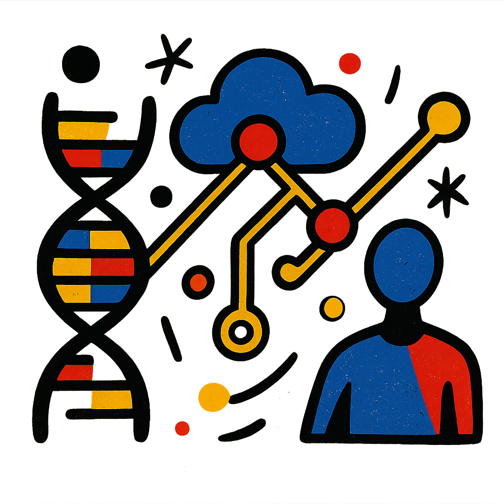

<h1 style="display: flex; align-items: center; justify-content: space-between;">
  
  Genomic Counseling AI
</h1>

## Setup Instructions

### Download GWAS Catalog Data

To run this project, you must first download the full GWAS Catalog dataset:

📥 **Download link**: [https://www.ebi.ac.uk/gwas/api/search/downloads/full](https://www.ebi.ac.uk/gwas/api/search/downloads/full)

Save the downloaded file (rename it to `gwas_catalog.tsv`) into the following directory: `data/catalog/`

## Data Disclaimer Statement

- **Personal Genome Project (PGP)**: Public domain (CC0). See https://www.personalgenomes.org
- **GWAS Catalog**: Sourced from the NHGRI-EBI GWAS Catalog, licensed under the Open Database License (ODbL). See https://www.ebi.ac.uk/gwas/ and https://opendatacommons.org/licenses/odbl/
